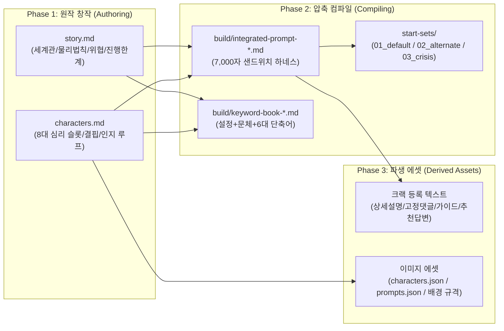

# 🏛️ Crack Story Architect (크랙 스토리 아키텍트)

> **크랙(Crack) 인터랙티브 스토리챗 설계 · 프롬프트 압축 컴파일 · 이미지 에셋 제작 통합 아키텍처**
>
> Claude Code 플러그인으로 설치하거나, Antigravity·Cursor·Windsurf·Roo Code·Aider에 스킬로 등록해 사용합니다.

[](https://github.com/CREE1116/crack-story-architect/actions/workflows/validate.yml)
[](LICENSE)

---

## 이게 뭔가

크랙은 시스템 프롬프트 **7,000자**, 프롤로그·시작 프롬프트 각 **1,000자**, 키워드북 항목당 **UTF-16 400자**라는
딱딱한 한도 위에서 돌아갑니다. 설정을 아무리 잘 짜도 그 한도 안으로 들어가지 않으면 플랫폼이 조용히 잘라냅니다.

이 레포는 그 문제를 **창작(Authoring)과 컴파일(Compiling)의 분리**로 풉니다.
글자 수 제한 없는 정본 두 개(`story.md`, `characters.md`)를 먼저 쓰고,
거기서 규격에 맞는 산출물을 기계적으로 뽑아낸 뒤, 검사기로 한도 위반을 잡습니다.

---

## 스토리 온보딩 사이트

작품 안의 공개 기록처럼 읽히는 [HTML/CSS 템플릿 3종](templates/showcase-sites/README.md)을 제공합니다.

- [전술 단말기](templates/showcase-sites/terminal/index.html): 입소 안내·구역 동선·현장 인원.
- [길드 게시판](templates/showcase-sites/guild/index.html): 접수원의 기록·공개 의뢰서·길드 사람들.
- [기록관](templates/showcase-sites/archive/index.html): 근무 인계·시작 위치·당직 인원.

각 폴더를 복사하고 예시 설정을 작품 정본으로 교체하면 됩니다. 홍보 카피나 숨은 설정 대신 첫 진입에 필요한 정보만 담습니다.
[공개 범위와 설계 지침](references/immersive-showcase-design.md), [설계 양식](templates/showcase-design-template.md), [호스팅·배너 지침](references/hosting-showcase-and-banner.md)을 함께 제공합니다.

---

## 설치

### 방법 1. Claude Code 플러그인 (권장)

```bash
# 1) 이 레포를 마켓플레이스로 등록
claude plugin marketplace add CREE1116/crack-story-architect

# 2) 플러그인 설치
claude plugin install crack-story-architect@crack-story-architect
```

설치 후 `/plugin` 으로 활성 상태를 확인합니다. 스킬은 `crack-story-architect` 이름으로 노출됩니다.
업데이트는 `claude plugin marketplace update crack-story-architect`.

### 방법 2. 스킬로 직접 등록 (설치 스크립트)

```bash
git clone https://github.com/CREE1116/crack-story-architect.git
cd crack-story-architect

./scripts/install.sh claude --global          # Claude Code 전역 스킬
./scripts/install.sh antigravity ~/my-project # Google Antigravity
./scripts/install.sh cursor      ~/my-project # Cursor MDC 룰 생성
./scripts/install.sh windsurf    ~/my-project # Windsurf 룰 등록
./scripts/install.sh roo         ~/my-project # Roo Code / Cline
./scripts/install.sh aider       ~/my-project # Aider
./scripts/install.sh all         ~/my-project # 전부
```

스크립트는 클론한 위치를 자동으로 찾아 심볼릭 링크와 룰 파일을 만듭니다. 경로를 손으로 고칠 필요가 없습니다.

### 방법 3. 수동 등록

레포를 클론한 경로를 `$SKILL_DIR`이라고 하면:

| 에이전트 | 등록 위치 |
|---|---|
| Claude Code (전역) | `ln -s $SKILL_DIR ~/.claude/skills/crack-story-architect` |
| Claude Code (프로젝트) | `ln -s $SKILL_DIR <프로젝트>/.claude/skills/crack-story-architect` |
| Antigravity (전역) | `ln -s $SKILL_DIR ~/.gemini/antigravity/skills/crack-story-architect` |
| Antigravity (프로젝트) | `ln -s $SKILL_DIR <프로젝트>/.agents/skills/crack-story-architect` |
| Cursor | `.cursor/rules/crack-story-architect.mdc`에 `$SKILL_DIR/SKILL.md` 참조 |
| Windsurf | `.windsurfrules`에 `$SKILL_DIR/SKILL.md` 참조 |
| Roo Code / Cline | `.clinerules/crack-story-architect.md`에 `$SKILL_DIR/SKILL.md` 참조 |
| Aider | `.aider.conf.yml`의 `read:`에 `$SKILL_DIR/SKILL.md` 추가 |

### 의존성

`SKILL.md`와 `references/`만 쓴다면 설치할 것이 없습니다.
`tools/images/`의 이미지 툴체인을 쓸 때만:

```bash
pip install -r requirements.txt
```

단부루 태그 검색(`search_tag.py`)은 별도의 위키 DB(`wiki.sqlite3`)를 요구합니다.
DB는 [novel-ai-image-skill](https://github.com/CREE1116/novel-ai-image-skill)에 들어 있고,
어디에 두었든 `CRACK_WIKI_DB` 환경변수로 가리킬 수 있습니다:

```bash
export CRACK_WIKI_DB=/path/to/wiki.sqlite3
```

---

## 빠른 시작

```bash
# 1. 새 프로젝트를 빈 양식에서 시작
cp -r templates/story-chat-template ~/my-story

# 2. Phase 1 — 정본을 채운다 (글자 수 제한 없음)
$EDITOR ~/my-story/story.md ~/my-story/characters.md

# 3. 아직 컴파일 전이어도 구조는 검사된다
./scripts/validate.sh ~/my-story --allow-unbuilt

# 4. Phase 2~3 — 에이전트에게 컴파일을 맡긴다
#    "crack-story-architect 스킬로 ~/my-story 를 컴파일해줘"

# 5. 규격 검증
./scripts/validate.sh ~/my-story
```

완성된 실물이 필요하면 [`examples/apocalypse/`](examples/apocalypse/)를 봅니다.
정본부터 통합 프롬프트·키워드북·파생 에셋까지 전부 채워져 있고 CI가 매 푸시마다 검증합니다.

---

## ⚡ 3단계 제작 파이프라인



1. **Phase 1 — 원작 창작**: 글자 수 제한 없이 세계의 물리법칙, 하드 룰, 위협 분류학(4~8종),
   인물의 3층위 인지심리학 모델(8대 심리 슬롯, 충돌하는 욕구, 역린·트라우마 회복 곡선)을 정본으로 세웁니다.
2. **Phase 2 — 압축 컴파일**: 전보체 인물 명부(`-이름[...]`), 3단 입력 파싱, 상하단 샌드위치 하네스,
   4단계 전투 루프, 다중 시작 세트로 7K/1K/400자 한도를 맞춥니다.
3. **Phase 3 — 파생 에셋**: 크랙 웹 등록용 산출물(상세설명 3대 블록, 고정 댓글 4대 블록, 플레이 가이드,
   추천 답변)과 시각 에셋 파이프라인(`characters.json`, `prompts.json`, 1024x400 배경 규격)을 빌드합니다.

---

## ✅ 검증 (`scripts/validate.sh`)

규격 위반은 플레이 중에 아무 신호도 내지 않습니다. 프롬프트만 조용히 잘리고, 모델만 조용히 옛 설정을 연기합니다.
그래서 컴파일 결과는 사람이 읽기 전에 기계가 먼저 봅니다.

```bash
./scripts/validate.sh examples/apocalypse
```

| 검사기 | 잡는 것 |
|---|---|
| `check_freshness.py` | 원본을 고치고 재컴파일을 잊은 상태. 바뀐 섹션과 다시 봐야 할 산출물까지 알려줌 |
| `check_project_layout.py` | 정본이 정확히 두 개인지, `build/`에 6개 산출물만 있는지 |
| `check_build.py` | 7K/1K 한도, SAFE·UNSAFE 섹션 제목 일치, 우회 문구 혼입 |
| `check_keyword_book.py` | 항목당 UTF-16 400자, 키워드 1~5개, `.` 상시 트리거 핵, 단축어 슬래시·이름·설명 한도 |
| `check_symbols.py` | 정의 없이 쓰인 기호·이모지, 범례보다 먼저 등장한 기호 |
| `check_image_assets.py` | `characters.md` 명부와 이미지 슬러그 불일치, 시드 중복, 선두 태그 충돌 |
| `check_naming.py` | 폐기된 `char.` / `canon.` 점 표기 잔존 |

컴파일 직후에는 신선도 기준점을 찍어둡니다:

```bash
python3 scripts/checks/check_freshness.py <project> --stamp
```

---

## 📚 8대 마스터 레퍼런스 (`references/`)

| 단계 | 문서 | 핵심 주제 |
|:---:|---|---|
| **Phase 1** | [authoring-story-and-characters.md](references/authoring-story-and-characters.md) | 인지심리학 3층위 모델, 8대 심리 슬롯, 10단계 인지 루프, 충돌 욕구, 역린 회복 곡선, 위협 분류학 |
| **Phase 2** | [master-prompt-template.md](references/master-prompt-template.md) | 올인원 백지 템플릿, 전보체 명부, 3단 파싱, 샌드위치 하네스, 4단계 전투 루프 |
| **Phase 2** | [keyword-book-guide.md](references/keyword-book-guide.md) | 설정 압축형 + 문체 조절형, 부분문자열 충돌 방지, 3슬롯 예산, 단축어 동기화 |
| **Phase 2** | [narrative-and-agency.md](references/narrative-and-agency.md) | PC 주권, 간접 인용, 비피학적 현실저항 가드, 발화자 상한, 시간 Desync 방어 |
| **Phase 2** | [openings-and-start-sets.md](references/openings-and-start-sets.md) | 다중 시작 세트 규약, 7단 줌인 프롤로그, 4단 핫스타트 오프닝 |
| **Phase 3** | [derived-assets-and-showcase.md](references/derived-assets-and-showcase.md) | `build/assets/` 산출물, 상세설명 3대 블록, 고정 댓글 4대 블록, 30자 후크 |
| **Phase 3** | [image-prompt-and-assets.md](references/image-prompt-and-assets.md) | 툴체인, 베이스 프롬프트, 태그 가감(+a/-소거) 원칙, CDN 규약 |
| **Common** | [platform-spec-and-lint.md](references/platform-spec-and-lint.md) | 7K/1K/400자 규격, UTF-16 측정법, 6대 단축어 레시피, 빌드 체크리스트 |

---

## 🛠️ 이미지 툴체인 (`tools/images/`)

```bash
# 1. 단부루 태그 공식 검색 & 동의어 확인
python3 tools/images/search_tag.py "smile"
python3 tools/images/search_tag.py "ruins" "street" --body

# 2. 배경 프롬프트 컴파일러 (story.md 파싱 ➔ scene-design.md / prompts.json)
python3 tools/images/compose_scene.py \
  --parse-story <작품>/story.md \
  --output-md <작품>/build/assets/scene-design.md \
  --output-prompts-json <작품>/build/assets/prompts.json

# 3. 배경 크롭·리사이즈 (1024x400 규격화, WebP 변환, 순서 리네이밍)
python3 tools/images/crop_backgrounds.py \
  --src <원본_폴더> --out <작품>/deploy/scene \
  --size 1024x400 --format webp

# 4. 캐릭터 외형 린터 (characters.md 파싱 ➔ characters.json)
python3 tools/images/compose_character.py \
  --parse-md <작품>/characters.md \
  --output-json <작품>/build/assets/characters.json \
  --output-md <작품>/build/assets/character-design.md

# 5. WebP 일괄 압축 및 에셋 무결성 검사
python3 tools/images/deploy.py --convert-webp --root deploy/
```

툴 자체 테스트: `./scripts/test_tools.sh`

### 태그 가감(+a / -소거) 원칙

베이스 프롬프트는 인물의 헤어·눈·체형·대표 복장을 고정하는 **앵커**이고, 상황은 태그를 더하고 빼서 만듭니다.

* **전투/손상 (+a)**: `torn clothes, blood on cheek, disheveled hair, dynamic combat stance`
* **복장 교체 (-소거·대체)**: 아우터 소거 ➔ `hoodie, denim shorts` 또는 `pajamas`
* **밀착 씬 (-소거·결합)**: 의상·무기 소거 후 상황 태그 결합
* **간섭 방지 (-Glitch Guard)**: 포옹·밀착 구도에서 글리치를 유발하는 등 뒤 무기·모자·배낭 태그를 일시 제외

---

## 🔘 대표 단축어 6종

> **절대 규칙**: 단축어 `name`에 슬래시(`/`)를 붙이지 않습니다. 크랙 UI가 버튼 클릭 시 자동으로 `/`를 붙이기 때문에
> `/사칭교정`으로 등록하면 `//사칭교정`이 되어 명령이 인식되지 않습니다. (`check_keyword_book.py`가 잡습니다.)

| 단축어 | 유형 | 기능 |
|:---:|:---:|---|
| `OOC` | 시스템 질의 | 역할극 중단, 오류 원인과 조치를 3단으로 건조하게 보고 |
| `요약` | 상태 점검 | 이어쓰기 없이 날짜·위치·관계 단계·미해결 과제를 4줄로 |
| `사칭교정` | 메타 수정 | 플레이어 대사·행동 대필을 감지 시점으로 롤백 |
| `상태점검` | 내부 변수 확인 | 현장 인물의 겉모습·속내·관계 단계와 그 계기 |
| `다음날로` | 서사 진행 | 하루 경과. 밤사이 동향을 지문으로 연결하고 첫 행동은 남김 |
| `헌터그램` | 인게임 시스템 | 인게임 통신망·게시판 UI 전용 출력 |

메타형 단축어에는 `[시스템 공지: RP 즉시 중단 및 이어쓰기 금지]`를 명시해 캐릭터가 지시를 대사로 읊지 못하게 막습니다.

---

## 📁 레포 구조

```text
crack-story-architect/
├── SKILL.md                    # 스킬 본체 (단일 스킬 플러그인 규약: 루트에 위치)
├── references/                 # 8대 마스터 레퍼런스
├── templates/
│   ├── story-chat-template/    # 새 프로젝트용 빈 양식 (story·characters·start-sets)
│   ├── build-dir-contract.md   # 컴파일 후 build/ 에 있어야 하는 것
│   └── build-assets-contract.md
├── examples/apocalypse/        # 완성된 참조 프로젝트 (CI가 검증)
├── scripts/
│   ├── install.sh              # 에이전트별 설치·등록
│   ├── validate.sh             # 전체 규격 검사 러너
│   ├── test_tools.sh           # 이미지 툴 테스트
│   └── checks/                 # 검사기 8종
├── tools/images/               # 태그 검색·배경 컴파일·크롭·배포
└── .claude-plugin/             # plugin.json / marketplace.json
```

### 프로젝트 표준 레이아웃

```text
<project>/
├── story.md                         # [Phase 1] 세계 법칙, 갈등 엔진, 위협 체계 (무제한)
├── characters.md                    # [Phase 1] 8대 심리 슬롯, 충돌 욕구, 역린 (무제한)
├── start-sets/                      # [Phase 2] 다중 시작 세트
│   ├── 01_default/                  # 정규 입문 루트 (order: 0, default: true)
│   │   ├── meta.md                  # 세트 제목·설명·순서
│   │   ├── prologue.md              # 7단 줌인 도입 (≤ 1,000자)
│   │   ├── start-prompt.md          # 4단 핫스타트 첫 턴 (≤ 1,000자)
│   │   └── recommended-replies.md   # 세트 전용 추천 답변 3종
│   └── 02_alternate/                # 대안 루트 (order: 1)
└── build/                           # [Phase 2 & 3] 컴파일 생성물
    ├── integrated-prompt-safe.md    # 전연령 마스터 프롬프트 (≤ 7,000자)
    ├── integrated-prompt-unsafe.md  # 19+ 마스터 프롬프트 (≤ 7,000자)
    ├── keyword-book-safe.md         # SAFE 키워드북 + 단축어 (항목당 ≤ 400자)
    ├── keyword-book-unsafe.md       # 19+ 키워드북 + 성애 연출 모듈
    ├── prologue.md                  # 기본 세트 사본 (≤ 1,000자)
    ├── start-prompt.md              # 기본 세트 사본 (≤ 1,000자)
    └── assets/                      # 파생 에셋 (상세설명·고정댓글·이미지 프롬프트 등)
```

---

## 라이선스

[MIT](LICENSE) © CREE1116
